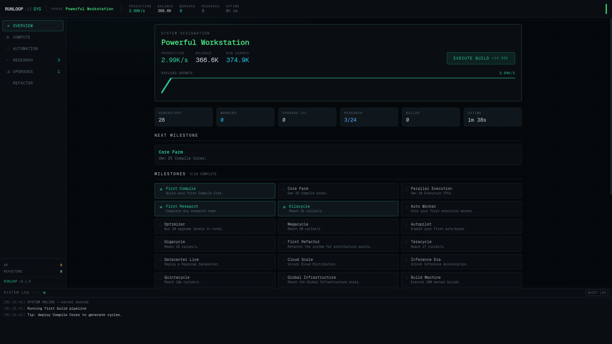
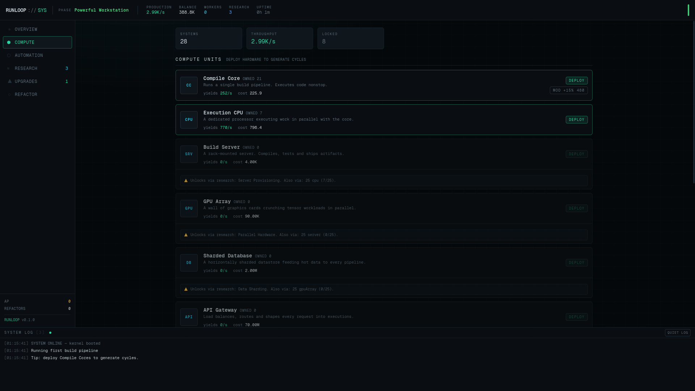
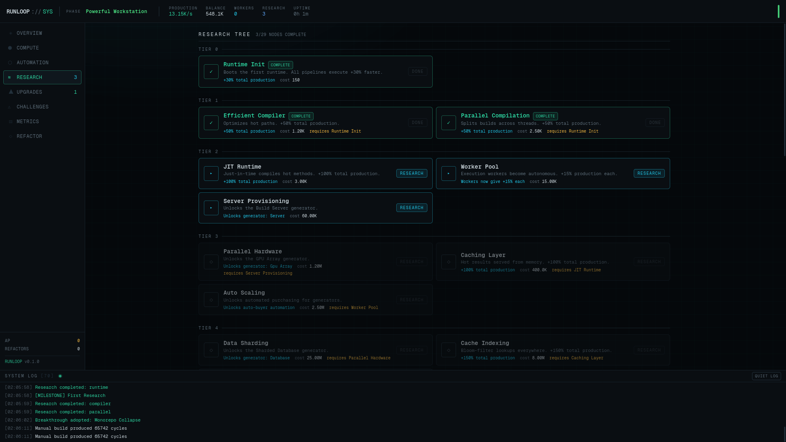
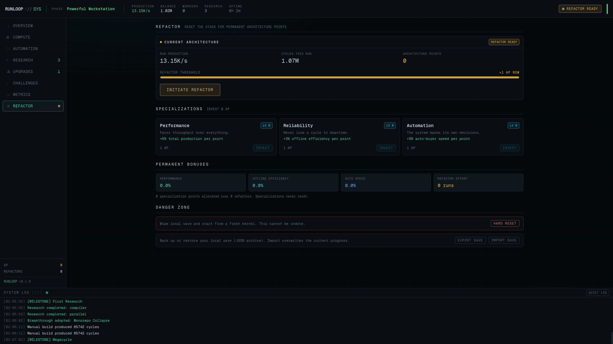

# RUNLOOP — incremental infrastructure

**RUNLOOP** is a browser-based **idle / incremental game** with a developer-and-infrastructure theme. You start as a lone developer compiling a single project on one machine and grow into someone operating global, self-healing infrastructure — and beyond.

> *"I started compiling a project… now I'm managing infrastructure at an absurd scale."*

<p align="center">
  
</p>

<p align="center">
  
</p>

<p align="center">
  
</p>

<p align="center">
  
</p>

---

## Gameplay

- **Cycles** are the primary resource. You produce them per second (`1.25K`, `8.42M`, `91.3B`…) and spend them on generators, upgrades and research.
- **10 procedural generators**, from *Compile Core* to *Inference Cluster* (CPU, Build Server, GPU Array, Sharded Database, API Gateway, Cluster Orchestrator, Regional Datacenter, Cloud Region…). Costs and production grow exponentially with level.
- **Repeatable upgrades** (Optimization Stack, PGO Compiler, Prefetch, Speculative Branch toggles…) and **one-time breakthroughs** (Monorepo, Edge Gateways, Serverless Fabric…) multiply production.
- **Research tree** (~33 nodes) unlocks multipliers, workers, servers, autoscaling and offline-efficiency bonuses.
- **Workers** give +4% production each (boosted by research); **auto-buyers** (autopilot) automate generator purchases once the *Autoscale* research is unlocked.
- **Manual deploy** button: clicking executes a build, banking a flat amount that scales only with your Compile Core count (plus click-related research) — it never scales with your full production multiplier.
- **Metrics panel**: a dedicated telemetry view with production composition by generator, a live multiplier stack (upgrades/breakthroughs/research/workers/architecture), lifetime stats (peak throughput, deploys, offline cycles earned) and a refactor-projection forecast.
- **Event-driven system log**: generator deploys, overclocks, worker joins, breakthroughs, upgrade milestones and offline restores are all streamed to a log that shifts tone as you scale tiers.
- **Refactor (prestige)**: past `10M` run cycles you can reset current infrastructure to gain **Architecture Points**, then specialize into **Performance**, **Reliability** or **Automation** for permanent, compounding bonuses.
- **Challenges (procedural meta-progression)**: 7 unlockable protocols (`Blackout`, `Bare Metal`, `Zero-Dependency Build`, `Skeleton Crew`, `No Magic`, `Manual Labor`, `Thermal Throttle`) each apply a handicap — no offline, no research, no upgrades, no workers, no breakthroughs, no automation, or halved throughput — until the run hits a target. Clearing a tier banks a permanent, across-run production bonus; tiers scale procedurally forever and rewards never reset.
- **Offline progress**: closing the tab pays off — production accrues while you're away, and a modal reports exactly what you earned.
- **Milestones & scale tiers**: milestones mark progression thresholds; your "workstation" designations evolve from *Developer Workstation* up to *Distributed Intelligence*.

Numbers use arbitrary-precision decimals (`break_infinity.js`), so growth can continue essentially forever without losing precision.

---

## Tech stack

| Layer            | Choice                                              |
| ---------------- | --------------------------------------------------- |
| Framework        | [Next.js 16](https://nextjs.org) (App Router, Turbopack, static export) |
| UI               | React 19 + TypeScript                               |
| Styling          | Tailwind CSS v4 (CSS-first theme, dark "terminal" palette) |
| State            | [zustand](https://github.com/pmndrs/zustand)        |
| Big numbers      | [break_infinity.js](https://github.com/Patashu/break_infinity.js) |
| Desktop wrapper  | [Electron](https://www.electronjs.org) (loads the static export) + electron-builder |
| Tests            | `tsx` smoke scripts (engine + store), no jest dependency |

---

## How it's made

The main design rule (from `AGENTS.md`) is: **game logic lives outside the React components.**

### Game engine (`src/game`)

- `types.ts` — shared types (`GameState`, `GeneratorDef`, `ResearchDef`, `ChallengeDef`, …).
- `economy.ts` — **data, not logic**: generator/research/upgrade/challenge/milestone definitions and cost curves.
- `engine.ts` — **pure functions** with no React/Zustand coupling: `computeProduction`, `buyGenerator`, `buyResearch`, `processAutoBuyers`, `computeOfflineGain`, `processRefactor`, `startChallenge`, `processSolveChallenge`, `getNextMilestone`, …
- `numbers.ts` — formatting (suffixed `K/M/B/T/Qa…`) and Decimal helpers.
- `save.ts` — serialization, versioned schema (`saveVersion: 2`) and defensive sanitization (rejects `NaN`/`Infinity`/negative values and incompatible shapes).
- `state.ts` — `createInitialState()` — the fresh-game state. Runs start at zero cycles; the manual **Execute build** clicker (`+1` base gain) funds the first Compile Core.
- `store.ts` — the Zustand bridge. Thin actions (`actBuyGenerator`, `actRefactor`, `actStartChallenge`, …) call pure engine functions, then commit results **preserving volatile UI state** (view, logs, toasts). This keeps every mutation testable.

### Game loop

- The store runs a `requestAnimationFrame`-free **interval loop at 10 Hz** (`TICK_MS = 100`).
- Production is computed from **real elapsed time** (`dt = now - lastTickAt`), so tab throttling, dips in FPS and background suspension don't break the economy.
- Autosave every 30s, plus save on `beforeunload` / `visibilitychange`.
- On reload, offline gain = `elapsedTime × productionPerSecond × efficiency` — deterministic, capped, no catch-up ticking of thousands of frames.

### UI (`src/components`)

- `ui.tsx` — small primitives (`Button`, `Card`, `Section`, `Stat`, `Badge`, `Bar`, `LockHint`, `Money`).
- `layout/` — `Header` (production, sessions), `Sidebar` (navigation), `LogPanel` (cosmetic system log), `Toasts` (feedback), `OfflineModal`.
- `views/` — `Overview`, `Compute`, `Automation`, `Research`, `Upgrades`, `Challenges`, `Metrics`, `Refactor` screens.
- `game/` — `GeneratorCard` (reused by Compute + Automation).

### Project structure

```text
src/
├── app/                 # Next.js app router (layout, page, globals.css)
├── components/
│   ├── GameShell.tsx    # Boot splash + top-level layout
│   ├── game/            # GeneratorCard
│   ├── layout/          # Header, Sidebar, LogPanel, Toasts, OfflineModal
│   ├── views/           # Overview, Compute, Automation, Research, Upgrades, Challenges, Metrics, Refactor
│   └── ui.tsx           # Shared primitives
├── game/
│   ├── types.ts         # Shared types
│   ├── economy.ts       # Balance data (definitions & costs)
│   ├── engine.ts        # Pure game logic
│   ├── numbers.ts       # Big-number formatting
│   ├── save.ts          # Persistence + sanitization
│   ├── state.ts         # Fresh-game state
│   └── store.ts         # Zustand store / game loop / actions
└── lib/cn.ts            # classnames helper
electron/
└── main.cjs             # Desktop shell (loads the `out/` static export)
scripts/
├── smoke.ts             # Engine tests (20 checks)
├── store-smoke.ts       # Store tests (boot, tick, offline, hard reset)
└── desktop-dev.mjs      # Dev harness: Next on :3200 + Electron pointing at it
```

The tests were genuinely useful during development — they caught two real bugs: the offline calculation always seeing `elapsed = 0`, and store commits dropping volatile UI fields.

---

## Getting started

### Requirements

- Node.js 18.18+ (Node 20+ recommended) and npm.

### Install

```bash
npm install
```

### Run in the browser (dev)

```bash
npm run dev
```

Open [http://localhost:3000](http://localhost:3000).

### Run the desktop app

RUNLOOP ships as an Electron desktop app. Two modes:

#### 1. Desktop dev (hot-reload, DevTools attached)

```bash
npm run desktop:dev
```

This boots a Next.js dev server on port `3200` and launches an Electron window pointed at it. Override the port with `RUNLOOP_DEV_PORT` if needed:

```bash
RUNLOOP_DEV_PORT=4100 npm run desktop:dev
```

#### 2. Desktop prod (offline static build)

```bash
npm run build
npm run desktop
```

Builds the static export to `out/`, then launches Electron loading it via the `app://` protocol — no network needed. If `out/` is missing, Electron shows an error box telling you to build first.

#### 3. Desktop distribution (installer packages)

```bash
npm run dist        # package + .deb/.AppImage for Linux
npm run dist:dir    # unpacked build only (fast iteration)
```

Packaging uses `electron-builder`.

### Smoke-test the desktop shell

A boot check verifies the window loads and renders `RUNLOOP` text, then exits. Works in dev mode (boot your own dev server with `RUNLOOP_DEV_URL`) or against a static build:

```bash
npm run build
RUNLOOP_SMOKE=1 npm run desktop    # prints SMOKE OK and quits
```

Note: `npm run desktop` insists on an existing `out/` build — run `npm run build` first.

### Run the tests

```bash
npm test            # engine (20 checks) + store (5 checks)
npm run test:engine
npm run test:store
```

### Lint & typecheck

```bash
npm run lint
npx tsc --noEmit
```

### Production build (web)

```bash
npm run build
npm run start
```

The game is a static App Router page — the build output can be served by any static host (Vercel, Netlify, a CDN, `npx serve out`, …). There is **no backend**: it's a pure client-side game; progress is saved in `localStorage` (the desktop app gets its own isolated profile per OS user).

---

## Customization guide

Because balance data lives in `economy.ts` and logic in `engine.ts`, tuning is straightforward:

- **Balance pacing** — edit costs/growth/production in `GENERATORS`, `RESEARCH`, `UPGRADES`.
- **New generator** — add a `GeneratorDef` to `GENERATORS` and (optionally) a research gate; the UI picks it up automatically.
- **New research** — add a `ResearchDef`; keep the tree acyclic via `prereq`.
- **New milestone / scale tier** — extend `MILESTONES` / `SCALE_TIERS`.
- **Refactor curve** — `getRefactorGain`/`processRefactor` in `engine.ts` and `specCost` in `economy.ts`.
- **New challenge** — add a `ChallengeDef` to `CHALLENGES` (pick a `ChallengeModifier`); targets/rewards scale from `targetBase`/`targetGrowth`/`rewardPerTier`.

After editing, run `npm test` to make sure nothing regressed.

---

## Roadmap

Development follows the phases in `AGENTS.md`. Currently complete:

- [x] **Phase 1** — layout, core resource, automatic production, upgrades, local save, offline progress.
- [x] **Phase 2** — deeper research tree & unlocks, richer logs, metrics/analytics panels.
- [x] **Phase 3** — prestige meta-progression, specializations, procedural challenge systems.
- [x] **Phase 4** — balance fixes (suffix rollover, chart overflow), milestone-completion feedback, floating feedback on manual builds, subtle tier-change animations, save export/import, perf hardening (logout/render path tweaks).

### Phase 4 polish notes

- Suffix formatting now rolls `999.95K → 1.00M` instead of showing `1000.0K`.
- The live throughput chart uses Decimal-safe log scaling, so it keeps painting even at absurd production values.
- Reaching a milestone pops a toast and logs it (`[MILESTONE] …`).
- Manual builds spawn a small floating `+N cycles` indicator.
- Crossing a scale tier (e.g. *Server Farm* → *Compute Cluster*) pulses the designation in the header and overview.
- The Refactor **Danger zone** gained **Export / Import save** (JSON archive) so progress can be backed up or moved between browsers.

---

## License

Feel free to fork for your own experiments.
